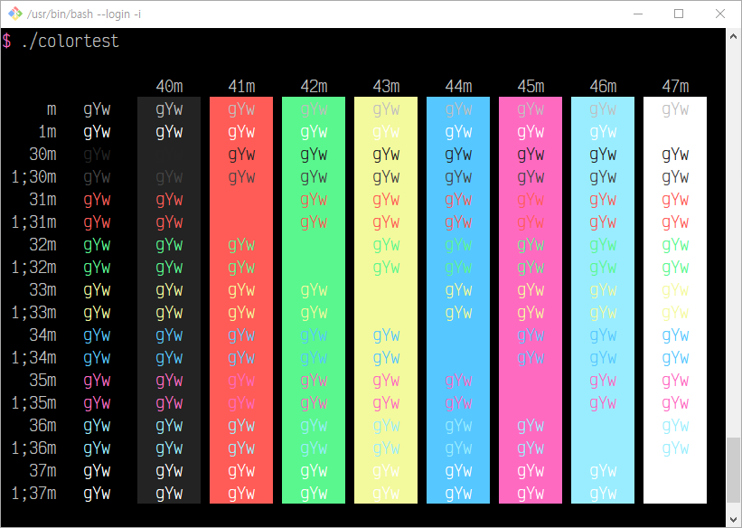

# mintty-snazzy

> Elegant mintty theme with bright colors

## Install

Copy the contents of `.minttyrc` to your `.minttyrc`

## Related

- [hyper-snazzy](https://github.com/sindresorhus/hyper-snazzy) - Hyper version
- [iterm2-snazzy](https://github.com/sindresorhus/iterm2-snazzy) - iTerm2 version
- [terminal-snazzy](https://github.com/sindresorhus/terminal-snazzy) - Terminal version
- [konsole-snazzy](https://github.com/miedzinski/konsole-snazzy) - Konsole version
- [vscode-snazzy](https://github.com/Tyriar/vscode-snazzy) - VS Code version
- [emacs-snazzy](https://github.com/weijiangan/emacs-snazzy) - Emacs version
- [termite-snazzy](https://github.com/kbobrowski/termite-snazzy) - Termite version
- [deepin-snazzy](https://github.com/xxczaki/deepin-snazzy) - Linux Deepin terminal version
- [vim-snazzy](https://github.com/connorholyday/vim-snazzy) - Vim version
- [base16-snazzy](https://github.com/h404bi/base16-snazzy-scheme) - Base16 version
- [kitty-snazzy](https://github.com/connorholyday/kitty-snazzy) - Kitty version
- [gnome-terminal-snazzy](https://github.com/tobark/hyper-snazzy-gnome-terminal) - Gnome terminal version
- [urxvt-snazzy](https://github.com/LeonGr/urxvt-snazzy) - Urxvt version
- [alacritty-snazzy](https://github.com/alebelcor/alacritty-snazzy) - Alacritty version
- [tilix-snazzy](https://github.com/clrxbl/tilix-snazzy) - Tilix version
- [terminus-snazzy](https://github.com/ThibzR/terminus-snazzy) - Terminus version
- [windows-terminal-snazzy](https://github.com/Richienb/windows-terminal-snazzy) - Windows Terminal version
